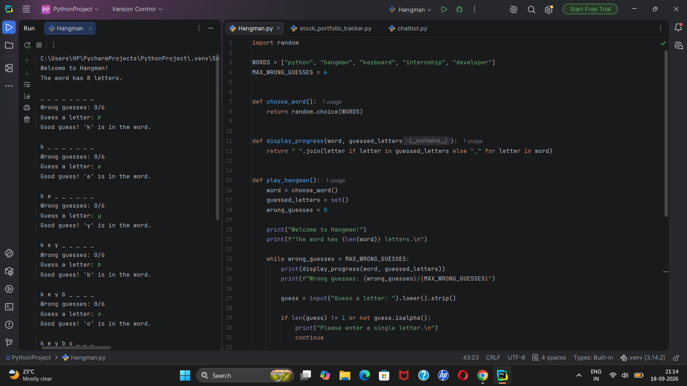
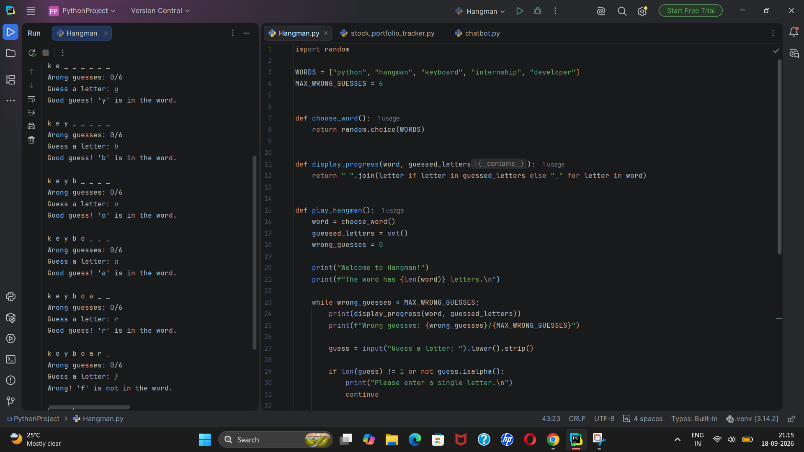
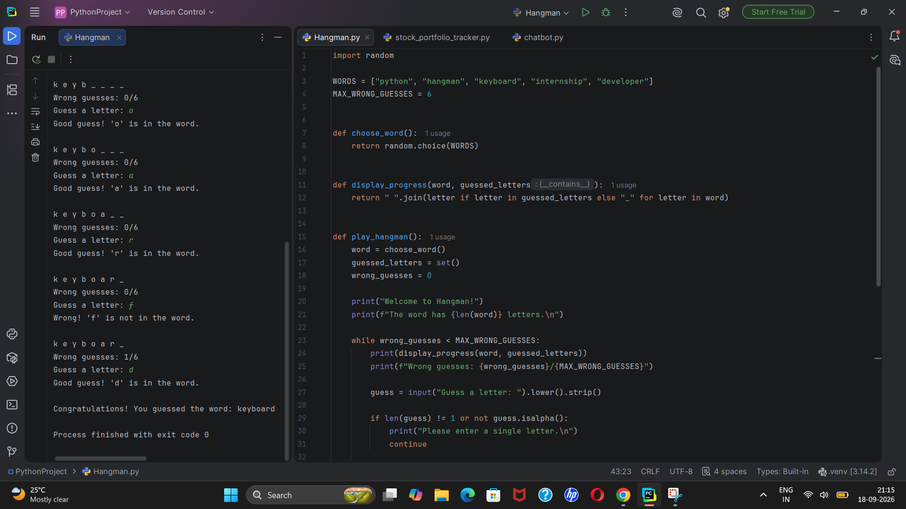
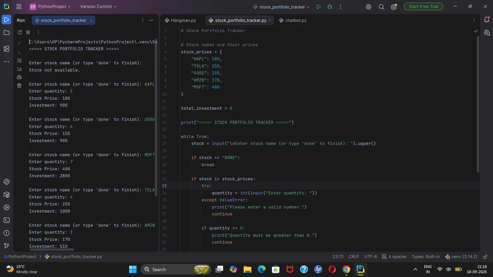
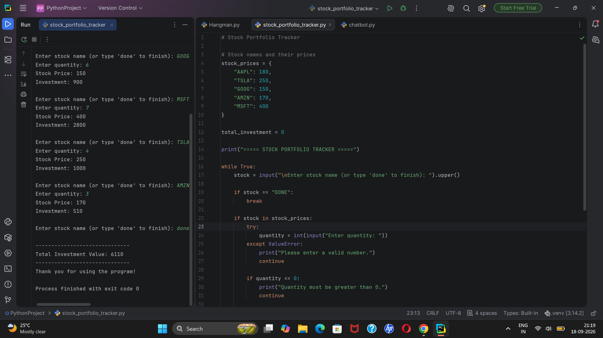
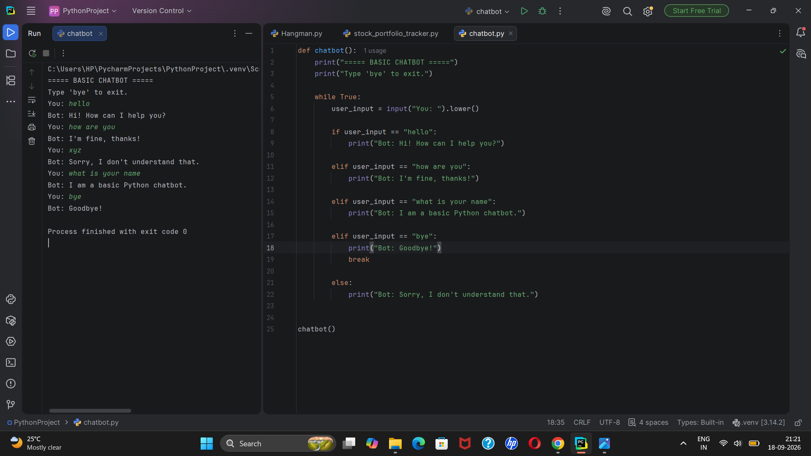

# CodeAlpha Python Programming Internship

This repository contains the projects completed as part of my **Python Programming Internship at CodeAlpha**.

The internship provided practical experience in Python programming, problem-solving, project development, testing, and GitHub repository management.

## Projects Completed

### Task 1 - Hangman Game

A simple console-based **Hangman Game** developed using Python.

The user has to guess the hidden word within a limited number of incorrect guesses. The program uses user input, strings, lists, loops, and conditional statements to implement the game.

**File:** `Hangman.py`

#### Output Screenshots

### Task 2 - Stock Portfolio Tracker

A Python-based **Stock Portfolio Tracker** that calculates the total investment based on stock prices and the quantity of stocks entered by the user.

The program accepts stock details from the user and calculates the investment value.

**File:** `stock_portfolio_tracker.py`

#### Output Screenshots

### Task 3 - Basic Chatbot

A simple Python-based **Basic Chatbot** that interacts with the user and provides responses to predefined questions or messages.

The chatbot uses conditional statements and user input to respond to different messages entered by the user.

**File:** `chatbot.py`

#### Output Screenshot

## Technologies Used

- Python
- PyCharm
- GitHub

## Python Concepts Used

The projects in this repository use the following Python programming concepts:

- Variables
- Strings
- Lists
- Dictionaries
- Loops
- Conditional Statements
- Functions
- User Input
- Exception Handling

## Repository Structure

CodeAlpha_PythonProgrammingInternship/
│
├── Hangman.py
├── chatbot.py
├── stock_portfolio_tracker.py
│
├── hangman1.png
├── hangman2.png
├── hangman3.png
│
├── chatbot.png
│
├── stockportfoliotracker1.png
├── stockportfoliotracker2.png
│
└── README.md

## Learning Outcomes

Through this internship, I gained practical experience in:

- Understanding and applying Python programming fundamentals
- Developing real-world Python projects
- Improving problem-solving and logical thinking skills
- Working with variables, strings, lists, dictionaries, loops, and conditional statements
- Using functions and user input effectively
- Developing and testing programs using PyCharm
- Understanding basic exception handling
- Learning how to upload, organize, and manage projects on GitHub
- Gaining confidence in writing and executing Python programs
- Understanding the process of developing a project from coding to testing and documentation
